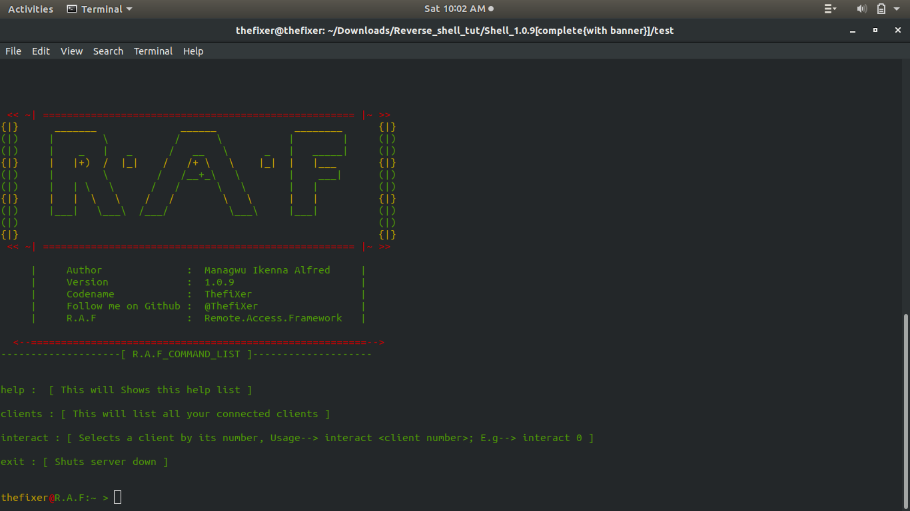

# R.A.F_Remote_Access_Framework_
Python Remote Access Tool [ Not Trojan ].

# Overview

R.A.F [Remote Access Framework] is a multi-client reverse-shell written in python. It is not multi-threaded yet however, modifications are in the works.
I greatly encourage any contributions. 

## Screenshots
     

## Getting started
1. `git clone `
2. `cd R.A.F_Remote-Access-Framework_`
3. `python3 R_A_F.py`

***

# Requirements

R.A.F is written in python 3.6 therefore you'll have to run with pytnon3

## Modules to install

* **psutil** 
* **zipfile**
* **platform** 
* **termcolor**

## Usage

To run R.A.F you'll need both the client.py and the server.py.

* **server.py** - This will run on public host and wait for connections from clients [port forwarding required if server is behind firewall (NAT)].
* **client.py** - This connects to the remote server and receives commands.
***

## Server

Simply run **server.py** using python 3.6

`python3 R_A_F.py` [see screenshots above]

To view all connected clients;

`'hostname'@R.A.F:~ > clients`

To interact with a client;

`'hostname'@R.A.F:~ > interact 0`

once inside client, use `help` to view command list, its a small list for now but modifications are in the works.

Enter any command in the list

## Client

You can run **client.py** using either python2 or python3

`python client.py` or `python3 client.py`

But first of all change the Host and Port variables in **client.py** to yours.

To compile to exe, for now use; `pyinstaller --onefile --windowed client.py` in terminal.

## Known Errors

* **download** - The download feature has a small bug, files do download but the loop breaks somewhere there and destabilizes the whole program
any help would really be appreciated.

***

# Disclamer
R.A.F was built as a utility to manage multiple machines at ones from any where in the world not for malicious purposes,
R.A.F should only be used in the lawful, remote administration of authorized systems. Accessing a computer network without authorization or permission is illegal. 
